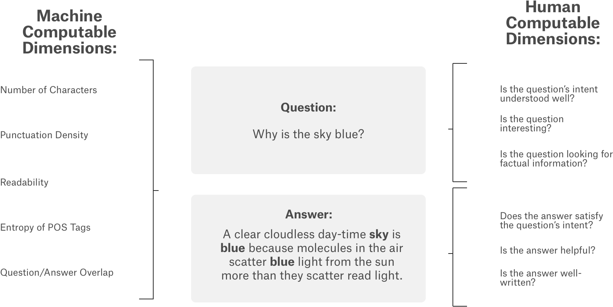

# Kaggle: Google QUEST Q&A Labeling ([link](https://www.kaggle.com/c/google-quest-challenge))

__Data__: 3 583 question-answer pairs (title, body, answer)

__Task__: predict target values of 30 labels for each question-answer pair

__Evaluation__: mean column-wise Spearman's Correlation Coefficient

__Solution__: BERT[[1]](https://arxiv.org/abs/1810.04805) fine-tuned with dense output layer

__Success__: 0.389 mean column-wise Correlation Coefficient

